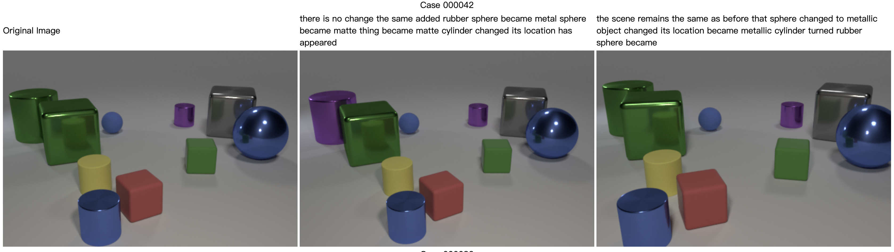

# 视觉与语言第三次作业

学号：2301213215。
姓名：黄博奕。

## 提交的内容

- 修改过的代码：

  代码借鉴了 [SCORER](https://github.com/tuyunbin/SCORER/) 等仓库和论文。

  - [models/CBR.py](./models/CBR.py)。
  - [models/transformer_decoder.py](models/transformer_decoder.py)。
  - [utils/utils.py](utils/utils.py)。
  - [models/SCORER.py](models/SCORER.py)。

- 实验结果：

  - 使用 [transformer_quick.yaml](configs/dynamic/transformer_quick.yaml) 时效果较差。

    分别以采用的前三组图片为例：

    - 验证集：

      
      
      

    - 测试集：

      
      
      

    上述六组样本中，每一组对应正向样本的输出都包含“the same”或者类似的短语，反而是验证集第二组反向样本、测试集第一组反向样本对应的输出并未包含类似短语。

    同时生成的每一项输出都存在一定语法上的问题。

    损失函数的变化如图所示：

    

  - 使用 [transformer.yaml](configs/dynamic/transformer.yaml) 时效果略好。

    分别以采用的前三组图片为例：

    - 验证集：

      
      
      

    - 测试集：

      
      
      

    损失函数随轮数的变化如图所示：

    

    

    可以直观定量地看到效果略好于不完整的训练。

    评估效果：

    

## 说明

很抱歉，主要由于我没有珍惜时间，再加上由于直接通过北大网盘客户端缓存下载的分卷压缩包似乎无法直接解压、并且实验用到了 Python、CUDA 和 Java 等多种环境，我浪费了一些时间，我没能按时提交作业。
