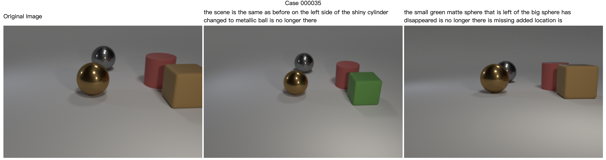

# 视觉与语言第三次作业

学号：2301213215。
姓名：黄博奕。

## 提交的内容

- 修改过的代码。

  代码借鉴了[SCORER](https://github.com/tuyunbin/SCORER/)等仓库和论文。

- 实验结果。
- 使用 [transformer_quick.yaml](configs/dynamic/transformer_quick.yaml) 时效果较差。

  以采用的前三组图片为例：

  
  
  

  每一组对应正向样本的输出都包含“the same”或者类似的短语，反而是第二组反向样本并未包含类似短语。

  同时生成的每一项输出都存在一定语法上的问题。

  损失函数如图所示：

  
